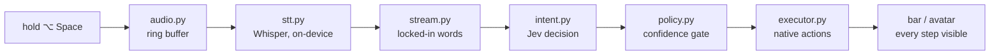

<p align="center">
  <picture>
    <source media="(prefers-color-scheme: dark)" srcset="brand/svg/banner-dark.svg">
    
  </picture>
</p>

<p align="center">
  <a href="https://github.com/manali-co/yapp/actions/workflows/ci.yml"></a>
  
  
  
  
  <a href="LICENSE"></a>
</p>

Hold **⌥ Space**, say what you want, let go. "Open Notes and switch to Safari" is two actions with no pause between them, and the second one starts while you're still saying the first.

Yapp is a small macOS app. Speech is transcribed on-device with Whisper as a stream of locked-in words. Every time the stream grows, the words not yet acted on go to [TypeSafe AI's Jev](https://docs.typesafe.ai), a decision model that answers typed questions with probabilities in well under half a second. Code does the rest: launch apps, dictate into the focused window word by word, open files, press shortcuts. Yapp never asks a question. If it got it wrong, say "undo".

<p align="center">
  
  <br>
  <sub>The avatar is Yapp's whole face: a pebble that breathes, leans in while you talk, tightens while it decides, and pulses in the direction of the action.</sub>
</p>

## Why it's different

- **It acts mid-sentence.** Most voice tools wait for silence, then think. Yapp decides on every locked-in word, so the first app is already open while you're describing the second.
- **No model writes text.** Jev only ever picks from options you gave it and says how sure it is. Anything free-form, such as what to type or which file you meant, is extracted in code. That keeps it fast and keeps it honest.
- **Confidence is the safety lever.** Every action has its own threshold. Above it, Yapp acts. Below it, nothing happens and the avatar shrugs.
- **Wrong is cheap.** "Undo" reverses the last action and teaches the app what you meant.
- **Testable without a microphone.** The whole intent layer runs on plain strings.

## Install

Yapp runs on Apple Silicon Macs (Whisper runs through MLX). You need [uv](https://docs.astral.sh/uv/) and a TypeSafe API key.

```sh
git clone https://github.com/manali-co/yapp.git && cd yapp
uv sync
export TYPESAFE_API_KEY=...
uv run yapp install-app        # writes ~/Applications/Yapp.app with the icon and menu-bar glyph
```

Then open **Yapp** from Applications. macOS will ask for the microphone, and you'll flip on Accessibility and Input Monitoring in System Settings; Yapp's first-run window stays open until all three are green. There are no signed builds or releases yet, so this is the install path for now.

## Use it

```sh
uv run yapp                                            # menu-bar app, hold ⌥ Space and talk
uv run yapp dev                                        # same loop, in the terminal
uv run yapp --once "open notes and switch to safari"   # run the pipeline on typed words, no audio
uv run yapp tasks                                      # the task suite in tasks/, on this Mac
uv run yapp eval                                       # accuracy per confidence bucket
```

Things people say to it:

> "open notes" · "new note, dinner on friday, remember the wine" · "switch to safari and search for the weather" · "open the downloads folder" · "undo"

## How it works



One Python process. Audio lands on a callback thread; everything else ticks every ~400 ms while the key is held. Each module is small and has one job, and each was run on its own before it was wired to the next. The full design, including the Jev primitives and why the thresholds are where they are, is in [`docs/superpowers/specs/2026-09-21-yapp-design.md`](docs/superpowers/specs/2026-09-21-yapp-design.md).

## Develop

```sh
uv sync --all-groups
uv run ruff check . && uv run ruff format . && uv run mypy src && uv run pytest
```

Tests marked `jev` hit the real API and skip themselves without `TYPESAFE_API_KEY`. CI runs the same four commands on macOS for every PR and every push to `dev` and `main`.

UI and the avatar are designed in Claude Design first and ported with `scripts/pull_design.py`; please don't improvise visuals in code. Everything else is in [CONTRIBUTING.md](CONTRIBUTING.md).

## Layout

| Path | What it is |
|---|---|
| `src/yapp/` | The app: audio → stt → stream → intent → policy → executor, plus the bar, the avatar and the menu-bar glue. |
| `src/yapp/ui/` | The bar, avatar, permissions window, tokens and icons, as shipped from Claude Design. |
| `tasks/` | End-to-end task YAMLs that `yapp tasks` runs against real apps. |
| `tests/` | Pytest suite, microphone-free. |
| `docs/` | The design spec and the plans that built it. |
| `brand/` | Icon, glyphs, banners and the avatar animation. See [`brand/README.md`](brand/README.md). |

## License and credit

Yapp is [CC BY 4.0](LICENSE). Use it, fork it, ship it, sell it if you must. The one rule is credit: name Manali, link back here, and say if you changed things.

If it ends up in something you write or publish, please cite it (GitHub's "Cite this repository" button reads [`CITATION.cff`](CITATION.cff)):

```bibtex
@software{manali_yapp_2026,
  author  = {Manali and Agrawal, Ayush},
  title   = {Yapp: hold a key, talk, and your Mac acts while you're still talking},
  year    = {2026},
  url     = {https://github.com/manali-co/yapp},
  license = {CC-BY-4.0}
}
```

<p align="center">
  <br>
  <a href="https://github.com/manali-co">
    <picture>
      <source media="(prefers-color-scheme: dark)" srcset="https://raw.githubusercontent.com/manali-co/.github/main/brand/svg/lockup-dark.svg">
      
    </picture>
  </a>
  <br>
  <sub>Made by Manali.</sub>
</p>
